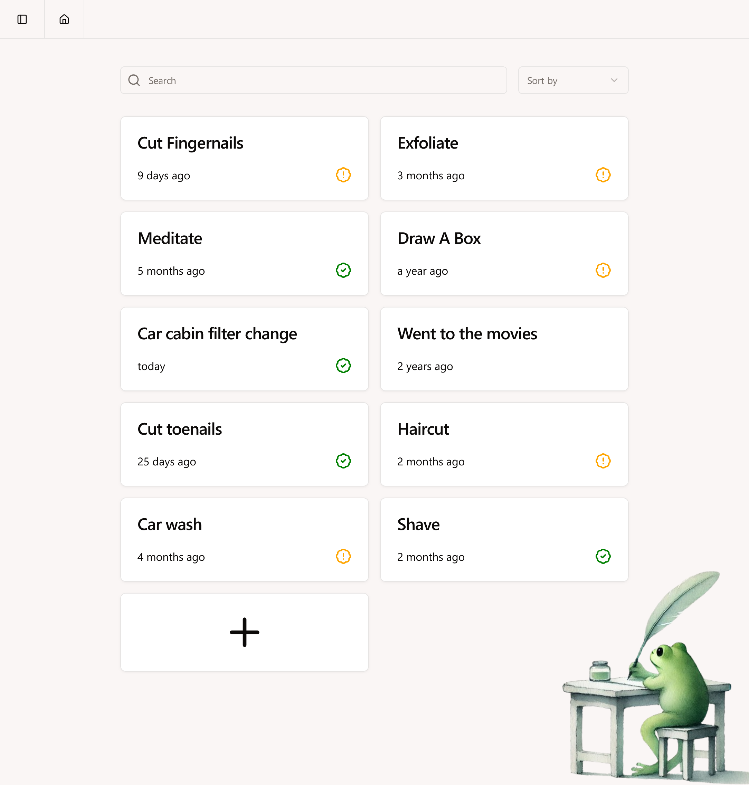

## About

Memoirs of a Frog is an application I wrote to help record frequency of how often I do a task. It's not a todo list, but more for record keeping and statistics.

## Screenshots




## Installation

Docker is recommended. Example docker compose file:

```yaml
services:
  memoirs-of-a-frog:
    image: ghcr.io/kangruixiang/memoirs-of-a-frog:latest
    container_name: memoirs-of-a-frog
    environment:
      - DATABASE_URL=file:db/local.db
      - TZ=America/New_York #add your timezone
    volumes:
      - /username/docker/memoirs-of-a-frog/db:/app/db #add your host directory
    ports:
      - 4001:80
    restart: always
```

## Upload

You can upload database backed up from Periodically under Upload. 